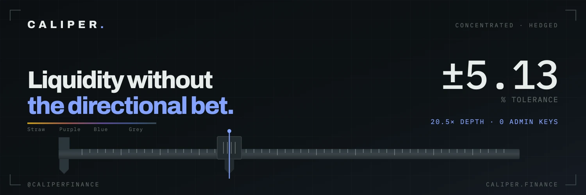
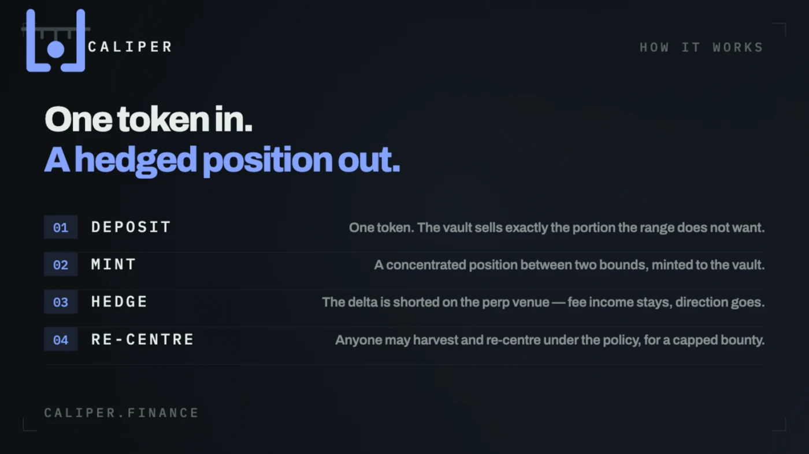
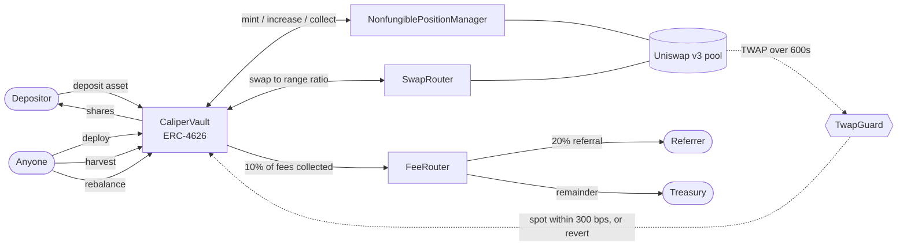
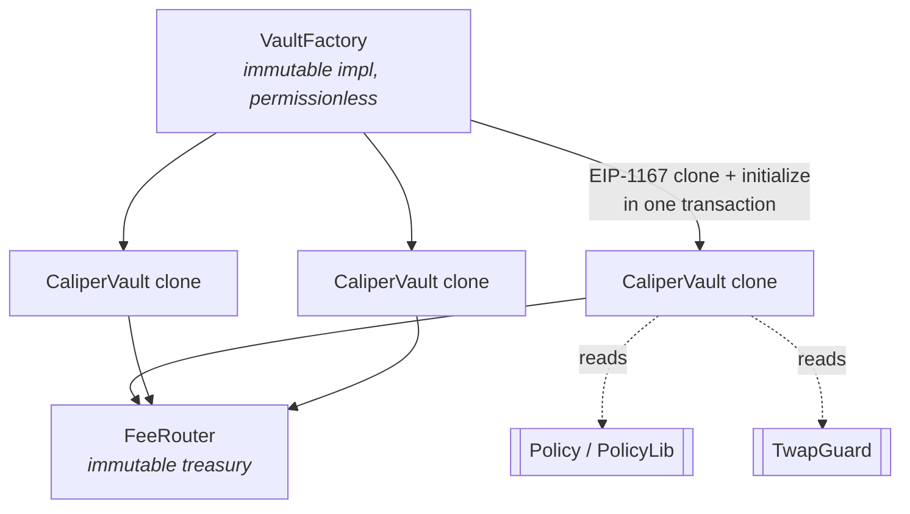
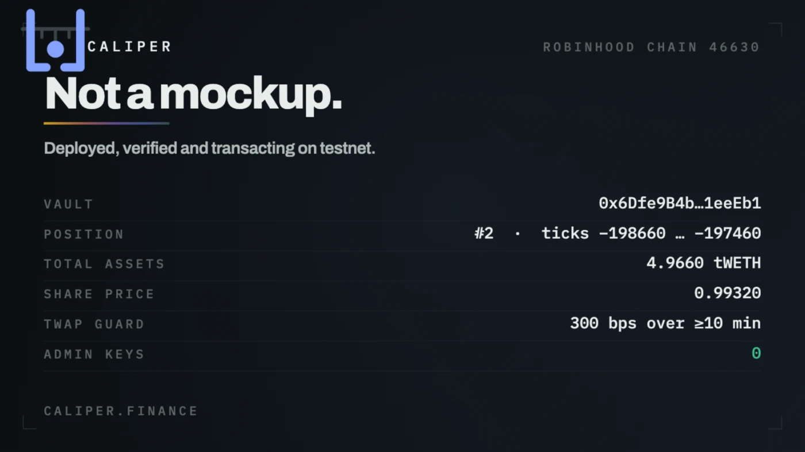

<div align="center">



<br>

# Caliper

**Concentrated liquidity with the directional risk hedged out, on Robinhood Chain.**

Deposit one token. The vault mints a concentrated Uniswap v3 position between bounds set by
policy, harvests its trading fees, and re-centres it when price leaves the range.

<br>

[](https://www.caliper.finance)
[](https://explorer.testnet.chain.robinhood.com)
[](#tests)
[](#security-model)


<br>

**[Live app](https://www.caliper.finance)** ·
[Overview](#overview) ·
[How it works](#how-it-works) ·
[Architecture](#architecture) ·
[Contracts](#contract-reference) ·
[Security](#security-model) ·
[Fees](#fees) ·
[Token](#token) ·
[Deployment](#live-deployment) ·
[Quickstart](#quickstart) ·
[Roadmap](#roadmap)

<br>

**Token contract**

`0xF9A3F7CA81629c8Ae268CBd2C7B37a25cc48059d`

</div>

---

## Overview

A Uniswap v3 liquidity provider earns trading fees, but concentrating liquidity to earn more
of them also concentrates exposure: the position is continuously rebalanced *against* the
mover, and the tighter the range, the harder that bites. Caliper's position is that the fee
income is the product and the directional exposure is a side effect to be managed.

The vault is the smallest complete expression of that. One ERC-4626 share token, one
concentrated position, one policy that fixes how wide the range is, how far price must run
before it re-centres, and how much slippage any single action may cost. Every parameter is
written at initialisation and has no setter. Nobody — including whoever deployed it — can
change the rules of a live vault, move a depositor's funds, upgrade the code or pause it.

| | |
|---|---|
| **Deposit** | One token. The vault sells exactly the portion the range does not want. |
| **Share token** | ERC-4626, ERC-20 transferable, priced off position principal plus loose balances. |
| **Range** | Concentrated, `widthTicks` wide, re-centred on spot when price escapes by more than `hysteresisTicks`. |
| **Fee income** | Collected by a permissionless `harvest()`, compounded back into the range by `deploy()`. |
| **Keeper** | Anyone. `harvest()` and `rebalance()` pay a bounty capped at 300 bps of collected fees. |
| **Governance** | None. No owner, no proxy, no upgrade path, no pause, no rescue. |



## Status

| Layer | State |
|---|---|
| `FeeRouter` — fees + referrals | ✅ **done, tested** |
| `CaliperVault` — ERC-4626 over one v3 position | ✅ **done, tested** |
| `VaultFactory` — EIP-1167 clones | ✅ **done, tested** |
| `TwapGuard` / `Policy` libraries | ✅ **done, tested** |
| Deploy script (incl. Uniswap v3 bring-up) | ✅ **done, dry-run green on a testnet fork** |
| Live testnet deployment | ✅ **deployed — [addresses below](#live-deployment)** |
| Front-end wallet integration | ✅ **done — [www.caliper.finance](https://www.caliper.finance)** |
| Range orders, hedged vault, structured notes | ⬜ not started |
| Indexer / API / keeper bot | ⬜ not started |

## How it works



The vault's life is five calls, three of which anyone may make.

### 1. `deposit(assets, receiver)`

Checks spot against the TWAP, checks the deposit cap, mints shares at
`assets × totalSupply / totalAssets` — one-for-one while the vault is empty — and takes the
tokens. Funds land loose; share price is unchanged either way, because `totalAssets()` counts
loose balances and position principal identically.

### 2. `deploy()` — permissionless

Puts idle balances to work. On the first call it picks a range of `widthTicks` centred on
spot; afterwards it adds to the existing position. Before minting it swaps the holdings to
the ratio the range actually wants, then mints or increases liquidity. The whole operation is
bounded end to end — if `totalAssets()` afterwards is below `valueBefore` less the policy's
slippage cap, the call reverts.

It can only ever move the vault's own funds into the vault's own position, which is why it
needs no permissioning.

### 3. `harvest()` — permissionless

Collects trading fees, sends 10% of the collected amount to the `FeeRouter`, pays the caller
the policy's bounty, and leaves the remainder in the vault for the next `deploy()` to
compound. Rate-limited by `policy.minInterval`. **Principal is never touched by this path** —
a position that earned nothing pays nothing.

### 4. `rebalance()` — permissionless

Only callable once spot has left `[tickLower, tickUpper]` by more than
`policy.hysteresisTicks`, and no sooner than `minInterval` after the last action. Unwinds the
position, re-centres a fresh range on spot, rebalances the holdings to the new ratio and
mints — **always to the vault, never to the caller**.

### 5. `redeem(shares, receiver, owner)`

Burns shares, pulls a proportional slice of liquidity, sells the non-asset leg through the
pool under the policy's slippage bound, and pays out in `asset`.

## Architecture



| Contract | Lines | Responsibility |
|---|---:|---|
| [`CaliperVault.sol`](src/CaliperVault.sol) | 636 | ERC-4626 over exactly one concentrated position. Deposit, redeem, deploy, harvest, rebalance. |
| [`VaultFactory.sol`](src/VaultFactory.sol) | 74 | Clone deployer. One vault per `(pool, asset)` pair, permissionless, immutable implementation. |
| [`FeeRouter.sol`](src/FeeRouter.sol) | 72 | Where every protocol fee lands. Pull-based accounting, 20% referral share, write-once attribution. |
| [`libraries/Policy.sol`](src/libraries/Policy.sol) | 28 | The management rules, and the validation every vault runs at init. |
| [`libraries/TwapGuard.sol`](src/libraries/TwapGuard.sol) | 58 | Price-band check on every share-moving path. |

Configuration lives in storage rather than immutables so an EIP-1167 proxy reads its own
values. The implementation's constructor marks it initialised, so it can never be configured
and mistaken for a live vault.

## Contract reference

### `CaliperVault` — ERC-4626 surface

| Function | Notes |
|---|---|
| `deposit(uint256 assets, address receiver) → shares` | TWAP-guarded, cap-enforced. |
| `redeem(uint256 shares, address receiver, address owner) → assets` | TWAP-guarded, honours ERC-20 allowance. |
| `totalAssets() → uint256` | Loose balances + position principal, in `asset`. Non-asset leg valued **net of the pool fee**; uncollected fees deliberately excluded. |
| `convertToShares` / `convertToAssets` | `mulDiv` against `totalSupply`. |
| `previewDeposit` / `previewRedeem` | Views onto the same maths. |
| `maxDeposit(address) → uint256` | Remaining headroom under `cap`. |
| `maxRedeem(address owner) → uint256` | The owner's share balance. |
| ERC-20: `approve`, `transfer`, `transferFrom`, `balanceOf`, `allowance`, `totalSupply`, `name`, `symbol`, `decimals` | Shares are freely transferable; `decimals` mirrors the asset. |

### `CaliperVault` — keeper surface

| Function | Callable by | Guard |
|---|---|---|
| `deploy()` | anyone | TWAP band; end-to-end slippage bound on `totalAssets()`. |
| `harvest()` | anyone | `minInterval` since last action. |
| `rebalance()` | anyone | `minInterval`, TWAP band, and spot outside the range by more than `hysteresisTicks`. |

Public state worth reading: `asset`, `token0`, `token1`, `feeTier`, `tickSpacing`, `pool`,
`positionManager`, `router`, `feeRouter`, `cap`, `policy`, `tokenId`, `tickLower`,
`tickUpper`, `lastActionAt`, and the constants `TWAP_WINDOW` (600) and `TWAP_BAND_BPS` (300).

### `VaultFactory`

```solidity
function createVault(
    address pool,
    address asset,          // must be token0 or token1 of the pool
    uint256 cap,            // deposit ceiling, fixed forever
    Policy calldata policy, // validated against the pool's tickSpacing
    string calldata name,
    string calldata symbol
) external returns (address vault);
```

Reverts with `VaultExists()` if a vault already exists for that `(pool, asset)` pair. Also
exposes `vaultFor(pool, asset)`, `allVaults(i)`, `vaultCount()`, and the immutables
`implementation`, `feeRouter`, `positionManager`, `router`.

### `FeeRouter`

| Function | Notes |
|---|---|
| `setReferrer(address referrer)` | Callable **once** per address, by the referred user only. No self-referral. |
| `take(address token, address user, uint256 amount)` | Pull-based — the caller must have approved first, so accounting cannot be desynced by a bare transfer. |
| `claim(address token) → amount` | Withdraws everything owed to the caller. |
| `treasury` | `immutable`, fixed at construction. No owner, no setter, no sweep. |

### `Policy`

```solidity
struct Policy {
    int24  widthTicks;      // total width of the range a re-centre mints
    int24  hysteresisTicks; // how far past the edge before a re-centre is allowed
    uint32 minInterval;     // seconds between actions
    uint16 maxSlippageBps;  // bound on the swap, the mint ratio and the round trip
    bool   compound;        // harvest puts the remainder back in, or pays it out
    uint16 bountyBps;       // paid to whoever spends the gas, capped by the contract
}
```

`PolicyLib.validate` is run once, at initialisation, and enforces:

| Rule | Bound |
|---|---|
| `widthTicks` | `> 0` and an exact multiple of the pool's `tickSpacing` |
| `hysteresisTicks` | `>= 0` |
| `maxSlippageBps` | `< 10_000` |
| `bountyBps` | `<= 300` (`MAX_BOUNTY_BPS`) |

There is no setter. A policy that passes validation is the policy that vault runs under for
the rest of its life.

## Security model



No contract has an owner. There is no `Ownable`, no proxy, no upgrade path, no pause switch
and no rescue function — the calls that would let anyone move a depositor's money were never
written, so there is no key to compromise. `test_noOwnerFunctionsExist` asserts it.

What bounds the system instead:

| Bound | Rule |
|---|---|
| **TwapGuard** | Every path that mints or burns shares at spot first checks spot sits within **300 bps** of an arithmetic-mean tick over **≥ 600 seconds** of real observed history, or reverts. |
| **Policy** | Range width, hysteresis, minimum interval, slippage cap and keeper bounty are written once at initialisation and have no setter. |
| **Deposit cap** | Fixed at creation, not raisable. |
| **Protocol fee** | 10%, taken from *fees collected only*. A position that earned nothing pays nothing, and no harvest path can reach principal. |
| **Bounty** | Capped by the contract at 300 bps of collected fees, however the policy is written. |
| **Clones** | Created and initialised in one transaction, so an unconfigured clone never exists in a block. The implementation's constructor marks it initialised, so nobody can claim it. |
| **Reentrancy** | Every value-moving entry point is `nonReentrant`. |
| **Share-price manipulation** | `totalAssets()` excludes uncollected fees, so `harvest()` cannot move the share price; and the non-asset leg is valued net of the pool fee, so the last redeemer does not eat a shortfall. |
| **Rebalance custody** | A re-centre always mints the replacement position back to the vault — never to the caller. |

### Custom errors

`AlreadyInitialized` · `NotInitialized` · `ZeroAddress` · `ZeroAmount` · `CapExceeded` ·
`InsufficientShares` · `TooSoon` · `InRange` · `NoPosition` · `SlippageExceeded` ·
`AssetNotInPool` · `BadPolicy` · `StaleOracle` · `PriceOutOfBand` · `VaultExists` ·
`AlreadyReferred` · `SelfReferral` · `NothingToClaim`

### Events

`Deposit` · `Withdraw` · `Deployed` · `Harvested` · `Rebalanced` · `VaultCreated` ·
`ReferrerSet` · `FeeTaken` · `Claimed` · plus ERC-20 `Transfer` / `Approval`

## Fees

| Cut | Size | Taken from |
|---|---|---|
| Protocol | **10%** (`PROTOCOL_FEE_BPS = 1_000`) | Trading fees collected by `harvest()`. Never principal. |
| Referral | **20%** of the protocol cut (`REFERRAL_BPS = 2_000`) | The `FeeRouter` inflow, if the account has a referrer. |
| Keeper bounty | `policy.bountyBps`, **≤ 300 bps** | The collected amount, paid to whoever spent the gas. |
| Remainder | everything else | Stays in the vault; `deploy()` compounds it back into the range. |

## Token

| | |
|---|---|
| Token contract | `0xF9A3F7CA81629c8Ae268CBd2C7B37a25cc48059d` |

The address above is the token contract. The contracts listed below are the vault stack,
which is separate from it and deployed on the testnet.

## Live deployment

**Robinhood Chain testnet · chainId 46630** · App: **[www.caliper.finance](https://www.caliper.finance)**

| Contract | Address |
|---|---|
| `vault` | [`0x6Dfe9B4bA8b93767E74139Aa049faDb1091eeEb1`](https://explorer.testnet.chain.robinhood.com/address/0x6Dfe9B4bA8b93767E74139Aa049faDb1091eeEb1) |
| `vaultFactory` | [`0xeBbF968f43D788aAde9041d0405aBdc256C3055D`](https://explorer.testnet.chain.robinhood.com/address/0xeBbF968f43D788aAde9041d0405aBdc256C3055D) |
| `vaultImpl` | [`0x0dff8830c26380d3F6fa11258C8f89847B5a13aE`](https://explorer.testnet.chain.robinhood.com/address/0x0dff8830c26380d3F6fa11258C8f89847B5a13aE) |
| `feeRouter` | [`0x853B3C8daAaE8a0e845c4EACA6fbB33BD48dD15f`](https://explorer.testnet.chain.robinhood.com/address/0x853B3C8daAaE8a0e845c4EACA6fbB33BD48dD15f) |
| `pool` | [`0xa0D9fAa381ac6CDe70D33f163fDcD15E56E42d0D`](https://explorer.testnet.chain.robinhood.com/address/0xa0D9fAa381ac6CDe70D33f163fDcD15E56E42d0D) |
| `positionManager` | [`0x4249252917EA0f09049cD03d0f515746FfF3b90f`](https://explorer.testnet.chain.robinhood.com/address/0x4249252917EA0f09049cD03d0f515746FfF3b90f) |
| `swapRouter` | [`0x00d904c19ae659425dA0a062898e9E6f9362B12F`](https://explorer.testnet.chain.robinhood.com/address/0x00d904c19ae659425dA0a062898e9E6f9362B12F) |
| `uniFactory` | [`0x113860755483b98d9A3340125c0B04a966573c65`](https://explorer.testnet.chain.robinhood.com/address/0x113860755483b98d9A3340125c0B04a966573c65) |
| `weth` | [`0x45BDdB9DC128eE4028FDeB8D35E59672Dae93B85`](https://explorer.testnet.chain.robinhood.com/address/0x45BDdB9DC128eE4028FDeB8D35E59672Dae93B85) |
| `usdc` | [`0xc4849573118Db5Ac414318D4332a6a7cFEE8F90C`](https://explorer.testnet.chain.robinhood.com/address/0xc4849573118Db5Ac414318D4332a6a7cFEE8F90C) |

Addresses are also machine-readable in [`deployments/46630.json`](deployments/46630.json).

Verified end to end on chain: deposit 10 tWETH → `deploy()` opened position #2 over ticks
−198660…−197460 → redeem 5 shares returned the assets.

### Chain

| | |
|---|---|
| Testnet RPC | `https://rpc.testnet.chain.robinhood.com` |
| Testnet chainId | `46630` (`0xb626`) |
| Explorer | [explorer.testnet.chain.robinhood.com](https://explorer.testnet.chain.robinhood.com) |
| Mainnet chainId | `4663` (`0x1237`) |

> [!NOTE]
> **Uniswap v3 is not deployed on the testnet.** The deploy script puts the canonical
> bytecode down first, then Caliper on top, then seeds one pool.

## Quickstart

Requires [Foundry](https://book.getfoundry.sh/getting-started/installation).

```bash
git clone https://github.com/caliper383-spec/Caliper.git
cd Caliper
forge build
forge test -vv
```

### Tests

11/11 pass against a **real** Uniswap v3 deployment — `test/utils/UniswapEnv.sol` puts the
canonical factory, position manager and router down from their artifacts, so the suite
exercises actual pool maths rather than a mock.

| Test | Asserts |
|---|---|
| `test_vaultIsConfigured` | Init wrote asset, pool, tokens, fee tier, spacing, cap and policy. |
| `test_implementationCannotBeInitialized` | The implementation is born initialised and cannot be claimed. |
| `test_depositMintsSharesOneToOneWhenEmpty` | First depositor gets 1:1. |
| `test_depositRespectsCap` | `CapExceeded` past the ceiling. |
| `test_deployOpensPositionAndPreservesValue` | Mint happens and `totalAssets()` survives the round trip. |
| `test_secondDepositorGetsProportionalShares` | Share maths against a non-empty vault. |
| `test_redeemReturnsAssets` | Proportional unwind pays out in `asset`. |
| `test_harvestIsPermissionlessAndPaysProtocol` | A stranger can harvest; the protocol cut reaches the `FeeRouter`. |
| `test_harvestRespectsMinInterval` | `TooSoon` inside the interval. |
| `test_rebalanceRefusesWhileInRange` | `InRange` while price is still inside the bounds. |
| `test_noOwnerFunctionsExist` | No owner, no upgrade, no pause, no rescue selector exists. |

### Interacting

```bash
VAULT=0x6Dfe9B4bA8b93767E74139Aa049faDb1091eeEb1
RPC=https://rpc.testnet.chain.robinhood.com

# read state
cast call $VAULT "totalAssets()(uint256)"  --rpc-url $RPC
cast call $VAULT "tickLower()(int24)"      --rpc-url $RPC
cast call $VAULT "tickUpper()(int24)"      --rpc-url $RPC
cast call $VAULT "previewDeposit(uint256)(uint256)" 1ether --rpc-url $RPC

# keeper calls — anyone may make these
cast send $VAULT "deploy()"    --rpc-url $RPC --account caliper-deployer
cast send $VAULT "harvest()"   --rpc-url $RPC --account caliper-deployer
cast send $VAULT "rebalance()" --rpc-url $RPC --account caliper-deployer
```

## Deploy to testnet

The deploy needs a funded key. Generate one, fund it, then run the script — **your key never
leaves your machine and is never committed**:

```bash
# 1. generate a deployer
cast wallet new

# 2. fund that address with testnet gas

# 3. deploy
export DEPLOYER_KEY=0x<your key>
forge script script/Deploy.s.sol:Deploy \
  --rpc-url rhtestnet --broadcast --slow
```

Addresses are written to `deployments/46630.json`.

Prefer a keystore over an env var for anything long-lived:

```bash
cast wallet import caliper-deployer --interactive
forge script script/Deploy.s.sol:Deploy --rpc-url rhtestnet --broadcast --account caliper-deployer
```

## Repository layout

```
src/
  CaliperVault.sol      ERC-4626 over one concentrated position
  VaultFactory.sol      clone deployer, permissionless
  FeeRouter.sol         fee sink + 20% referral share
  libraries/
    Policy.sol          management rules, validated at init
    TwapGuard.sol       price-band check on every share-moving path
test/
  CaliperVault.t.sol    end-to-end against real Uniswap v3
  utils/UniswapEnv.sol  deploys Uniswap from canonical artifacts
script/
  Deploy.s.sol          full stack bring-up
  Redeploy.s.sol        re-point an existing stack
deployments/
  46630.json            live addresses, machine-readable
lib/                    forge-std, openzeppelin-contracts, v3-core, v3-periphery
```

## Roadmap

| | Item |
|---|---|
| ✅ | Vault, factory, fee router, policy and TWAP guard — built and tested |
| ✅ | Live testnet deployment, verified end to end on chain |
| ✅ | Front-end with wallet integration at [caliper.finance](https://www.caliper.finance) |
| ⬜ | Range orders — one-sided ranges as resting limit orders |
| ⬜ | Hedged vault — the delta shorted on a perp venue, so fee income stays and direction goes |
| ⬜ | Structured notes over the vault's fee stream |
| ⬜ | Indexer and API for positions, fees and share-price history |
| ⬜ | Keeper bot — automated `harvest()` / `rebalance()` against the policy |
| ⬜ | Invariant and fuzz suite, then external review |

## Tech stack

**Solidity 0.8.26** · **Foundry** (forge, cast) · **Uniswap v3** (core + periphery) ·
**OpenZeppelin** (SafeERC20, ReentrancyGuard, Clones) · **ERC-4626** · **EIP-1167**

## License

Business Source License 1.1 (`BUSL-1.1`) for everything in `src/`; scripts and tests are
MIT. See the SPDX header at the top of each file.

---

<div align="center">


**[caliper.finance](https://www.caliper.finance)**

<sub>Built with Foundry · No owner · No upgrade path · No admin keys</sub>

</div>
