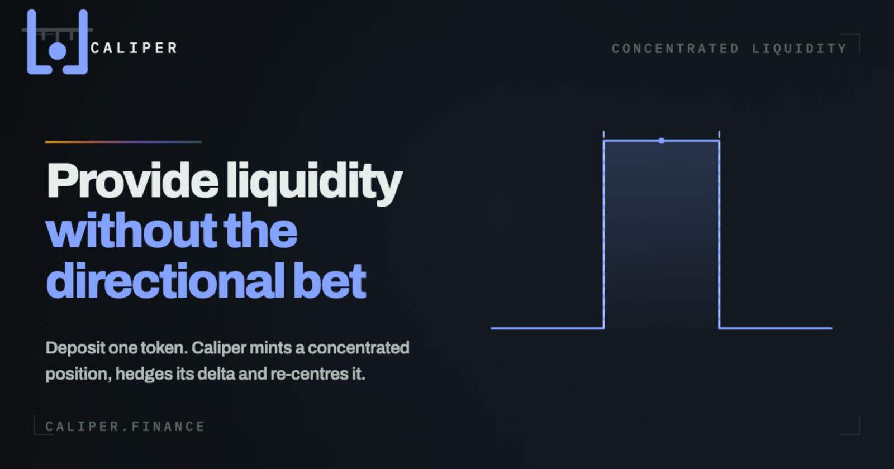
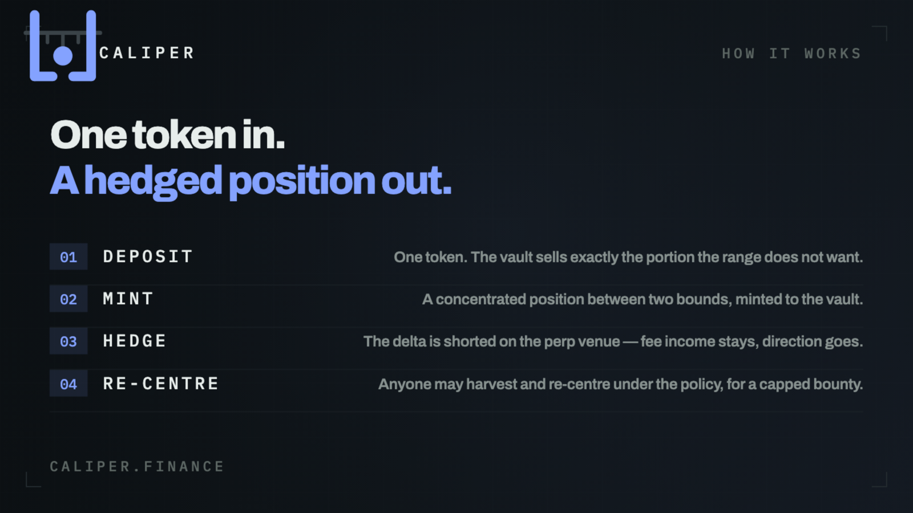
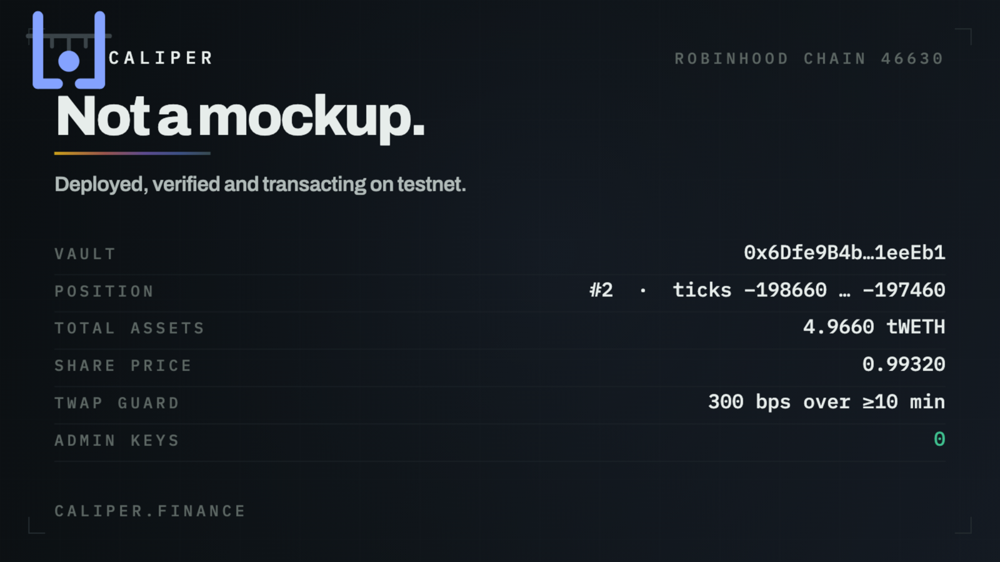

<div align="center">



<br>

**Concentrated liquidity with the directional risk hedged out, on Robinhood Chain.**

[](https://www.caliper.finance)
[](https://explorer.testnet.chain.robinhood.com)
[](#build-and-test)
[](#design)
[](foundry.toml)
[](#before-mainnet)

[**Live app**](https://www.caliper.finance) · [Deployment](#live-on-robinhood-chain-testnet-46630) · [Design](#design) · [Build](#build-and-test) · [Deploy](#deploy-to-testnet)

</div>

---

## What it does

Deposit one token. The vault mints a concentrated Uniswap v3 position between bounds set
by policy, harvests its trading fees, and re-centres it when price leaves the range.



## Status

| Layer | State |
|---|---|
| `FeeRouter` — fees + referrals | ✅ **done, tested** |
| `CaliperVault` — ERC-4626 over one v3 position | ✅ **done, tested** |
| `VaultFactory` — EIP-1167 clones | ✅ **done, tested** |
| `TwapGuard` / `Policy` libraries | ✅ **done, tested** |
| Deploy script (incl. Uniswap v3 bring-up) | ✅ **done, dry-run green on a testnet fork** |
| Live testnet deployment | ✅ **deployed — [addresses below](#live-on-robinhood-chain-testnet-46630)** |
| Front-end wallet integration | ✅ **done — [www.caliper.finance](https://www.caliper.finance)** |
| Range orders, hedged vault, structured notes | ⬜ not started |
| Indexer / API / keeper bot | ⬜ not started |

11/11 tests pass against a real Uniswap v3 deployment.

## Live on Robinhood Chain testnet (46630)



App: **[https://www.caliper.finance](https://www.caliper.finance)**

| Contract | Address |
|---|---|
| `feeRouter` | [`0x853B3C8daAaE8a0e845c4EACA6fbB33BD48dD15f`](https://explorer.testnet.chain.robinhood.com/address/0x853B3C8daAaE8a0e845c4EACA6fbB33BD48dD15f) |
| `pool` | [`0xa0D9fAa381ac6CDe70D33f163fDcD15E56E42d0D`](https://explorer.testnet.chain.robinhood.com/address/0xa0D9fAa381ac6CDe70D33f163fDcD15E56E42d0D) |
| `positionManager` | [`0x4249252917EA0f09049cD03d0f515746FfF3b90f`](https://explorer.testnet.chain.robinhood.com/address/0x4249252917EA0f09049cD03d0f515746FfF3b90f) |
| `swapRouter` | [`0x00d904c19ae659425dA0a062898e9E6f9362B12F`](https://explorer.testnet.chain.robinhood.com/address/0x00d904c19ae659425dA0a062898e9E6f9362B12F) |
| `uniFactory` | [`0x113860755483b98d9A3340125c0B04a966573c65`](https://explorer.testnet.chain.robinhood.com/address/0x113860755483b98d9A3340125c0B04a966573c65) |
| `usdc` | [`0xc4849573118Db5Ac414318D4332a6a7cFEE8F90C`](https://explorer.testnet.chain.robinhood.com/address/0xc4849573118Db5Ac414318D4332a6a7cFEE8F90C) |
| `vault` | [`0x6Dfe9B4bA8b93767E74139Aa049faDb1091eeEb1`](https://explorer.testnet.chain.robinhood.com/address/0x6Dfe9B4bA8b93767E74139Aa049faDb1091eeEb1) |
| `vaultFactory` | [`0xeBbF968f43D788aAde9041d0405aBdc256C3055D`](https://explorer.testnet.chain.robinhood.com/address/0xeBbF968f43D788aAde9041d0405aBdc256C3055D) |
| `vaultImpl` | [`0x0dff8830c26380d3F6fa11258C8f89847B5a13aE`](https://explorer.testnet.chain.robinhood.com/address/0x0dff8830c26380d3F6fa11258C8f89847B5a13aE) |
| `weth` | [`0x45BDdB9DC128eE4028FDeB8D35E59672Dae93B85`](https://explorer.testnet.chain.robinhood.com/address/0x45BDdB9DC128eE4028FDeB8D35E59672Dae93B85) |

Verified end to end on chain: deposit 10 tWETH → `deploy()` opened position #2 over ticks
−198660…−197460 → redeem 5 shares returned the assets.

## Design

No contract has an owner. There is no `Ownable`, no proxy, no upgrade path, no pause
switch and no rescue function — the calls that would let anyone move a depositor's money
were never written, so there is no key to compromise.

What bounds the system instead:

| Bound | Rule |
|---|---|
| **TwapGuard** | Every path that mints or burns shares at spot first checks spot sits within **300 bps** of a mean over **≥10 minutes** of real observed history, or reverts. |
| **Policy** | Range width, hysteresis, minimum interval, slippage cap and keeper bounty are written once at initialisation and have no setter. |
| **Deposit cap** | Fixed at creation, not raisable. |
| **Protocol fee** | 10%, taken from *fees collected only*. A position that earned nothing pays nothing, and no harvest path can reach principal. |
| **Clones** | Created and initialised in one transaction, so an unconfigured clone never exists in a block. The implementation's constructor marks it initialised, so nobody can claim it. |

`harvest()` and `rebalance()` are permissionless: anyone may call them, for a bounty capped
at 300 bps of collected fees, and a re-centre always mints the replacement position back to
the vault — never to the caller.

## Chain

| | |
|---|---|
| Testnet RPC | `https://rpc.testnet.chain.robinhood.com` |
| Testnet chainId | `46630` (`0xb626`) |
| Explorer | [explorer.testnet.chain.robinhood.com](https://explorer.testnet.chain.robinhood.com) |
| Mainnet chainId | `4663` (`0x1237`) |

> [!NOTE]
> **Uniswap v3 is not deployed on the testnet.** The deploy script puts the canonical
> bytecode down first, then Caliper on top, then seeds one pool.

## Build and test

Requires [Foundry](https://book.getfoundry.sh/getting-started/installation).

```bash
git clone https://github.com/caliper383-spec/Caliper.git
cd Caliper
forge build
forge test -vv
```

## Deploy to testnet

The deploy needs a funded key. Generate one, fund it, then run the script — **your key
never leaves your machine and is never committed**:

```bash
# 1. generate a deployer
cast wallet new

# 2. fund that address with testnet gas

# 3. deploy
export DEPLOYER_KEY=0x<your key>
forge script script/Deploy.s.sol:Deploy \
  --rpc-url rhtestnet --broadcast --slow
```

Addresses are written to `deployments/46630.json`.

Prefer a keystore over an env var for anything long-lived:

```bash
cast wallet import caliper-deployer --interactive
forge script script/Deploy.s.sol:Deploy --rpc-url rhtestnet --broadcast --account caliper-deployer
```

## Layout

```
src/
  CaliperVault.sol      ERC-4626 over one concentrated position
  VaultFactory.sol      clone deployer, permissionless
  FeeRouter.sol         fee sink + 20% referral share
  libraries/
    Policy.sol          management rules, validated at init
    TwapGuard.sol       price-band check on every share-moving path
test/
  CaliperVault.t.sol    end-to-end against real Uniswap v3
  utils/UniswapEnv.sol  deploys Uniswap from canonical artifacts
script/
  Deploy.s.sol          full stack bring-up
```

## Before mainnet

> [!WARNING]
> This code is **unaudited**. It has unit tests, not an audit, and no invariant or fuzz
> suite yet. **Do not put real user funds in it.**

---

<div align="center">


**[caliper.finance](https://www.caliper.finance)**

</div>
